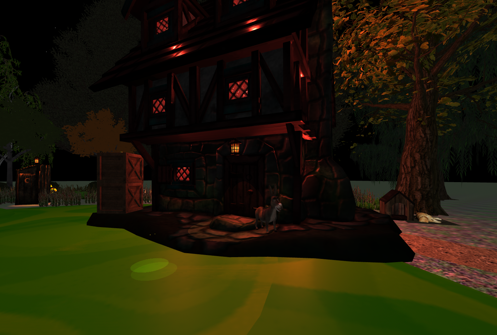
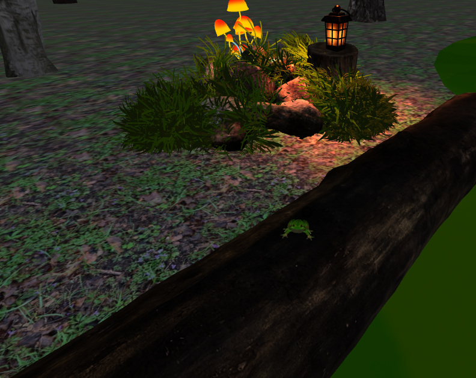
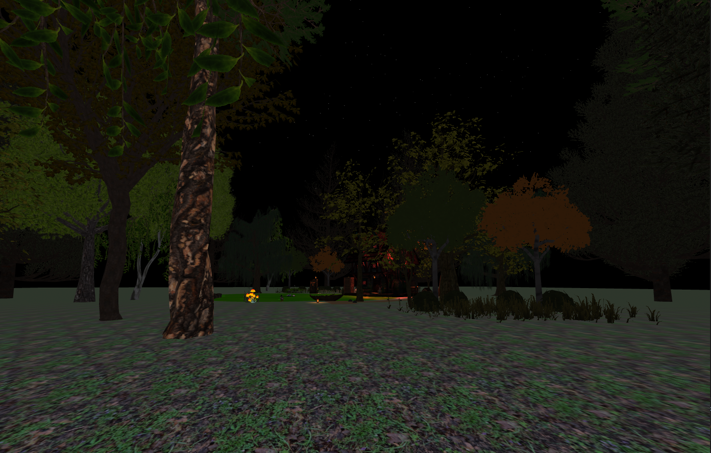
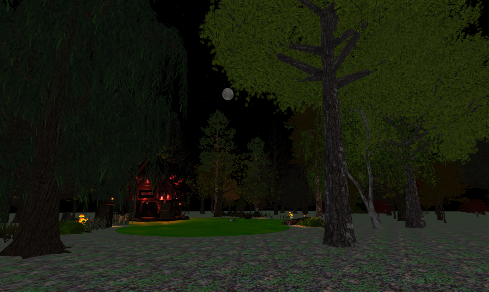

# This is a swamp

## Description du projet
Ce projet est une scène en réalité virtuelle qui s'inspire de l'étang du film Shrek. Le·la visteur·euse est accueilli·e par l'Âne qui l'attend sur le perron de la maison au milieu d'une forêt lors d'une soirée de pleine lune... Iel peut ensuite se balader autour de l'étang, afin d'y découvrir quelques éléments iconiques du film d'animation.

## Objectif du jeu
Ce projet propose un instant de découverte au sein d'une forêt où se cache une maisonnette. Le·la joueur·euse peut se balader uniquement sur la plateforme principale pour découvrir les différents éléments constituant le décor. Les développeuses de cette scène y ont dissimulé cinq grenouilles avec lesquelles il est possible d'interagir, de même qu'avec un canard, un chien, des toilettes et la lune. 

## Processus de Développement
Cette scène a été développée avec la volonté de recrée l'étang du film d'animation Shrek. Toutefois, les éléments 3D n'étaient pas tous disponibles gratuitement, nous avons donc pris certaines libertés pour, tout de même, proposer un décor d'étang. Tout d'abord, nous avons défini l'emplacement des éléments principaux : l'étang et la maison. Nous avons ensuite ajouté, puis enlevé, puis ajusté des éléments de détail pour arriver au résultat actuel. 

La première grande difficulté que nous avons rencontrée était la capacité de nos ordinateurs à tourner notre décor. Cela nous a souvent ralenties dans notre progression, nous avons dû faire des concessions, notamment dans la quantité d'arbre présent dans notre scène. 
La deuxième difficulté a été de donner une masse aux éléments de notre décor. Tout d'abord, nous avons pensé créer des frontières pour empêcher le·la joueur·euse de traverser les éléments de la scène. Nous sommes parvenues à créer des frontières pour la plateforme principale, mais il n'était pas possible de reproduire le même schéma pour les objets du décor. Nous avons décidé de permettre à le·la joueur·euse d'être omnipotent·e dans les limites de la plateforme. 

Le développement a été partagé équitablement entre nous. 

## **Outils utilisés**
- Ce projet a été réalisé en utilisant A-Frame et Visual Studio Code.

- Ce projet est le fruit d'un travail collaboratif réalisé principalement via Discord, mais aussi en personne avec l'extension Live Share de Visual Studio Code.

## Contexte de développement
Ce projet a été développé dans le cadre du cours "Réalité virtuelle et augmentée" (printemps 2022) enseigné par le Prof. Isaac Pante (SLI, Lettres, UNIL).
